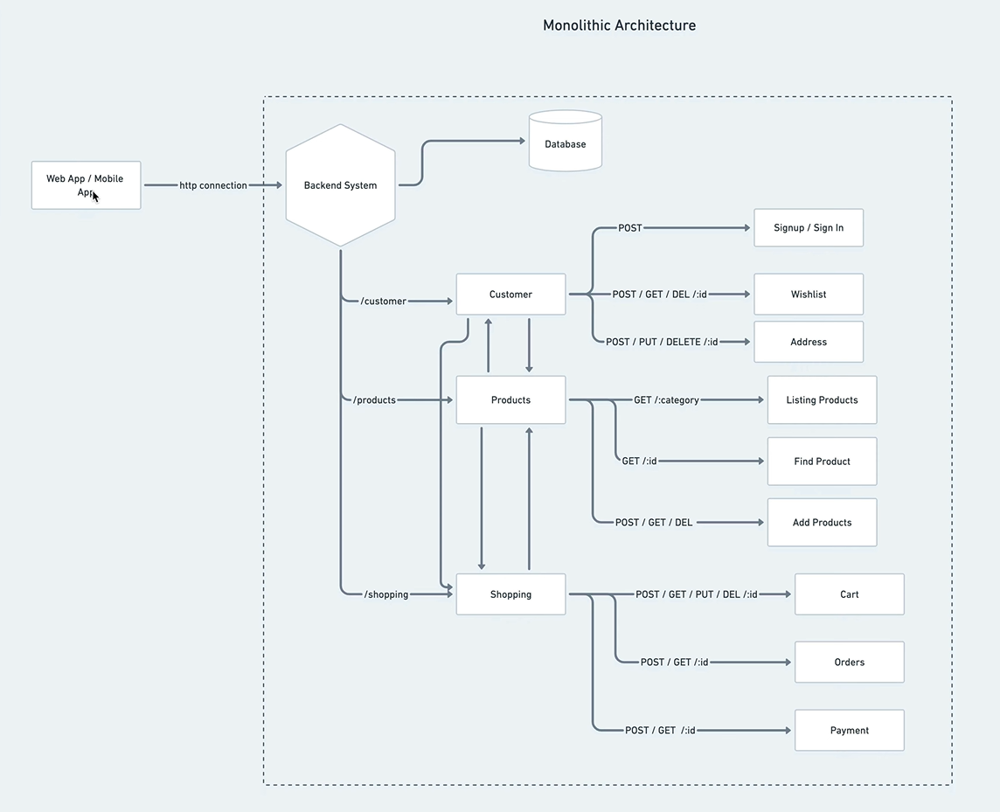

# E-Commerce - Microservice

This repository contains the code for an e-commerce application built with Node.js using microservices architecture.

## Getting Started

1. Clone the repository: `git clone https://github.com/ifhammohamed1111/E-Commerce-Micro.git`
2. Install the dependencies: `npm install`
3. Start the microservices: `npm run start:services`
4. Start the main application: `npm start`
5. The application will be available at `http://localhost:3000`.

## Elaboration of microService vs Monolithic

### Monolithic Architecture

In a monolithic architecture, all the components of the application are built as a single, indivisible unit. This means that the entire application is deployed as a single service, and all the components are tightly coupled together. This makes it difficult to scale the application, as the entire application needs to be replicated to handle increased load. Additionally, monolithic applications are difficult to maintain and update, as changes to one component can affect other components.

### Microservices Architecture

In a microservices architecture, the application is built as a collection of small, independent services, each of which is responsible for a specific domain or functionality. These services are loosely coupled, meaning that they can be developed, deployed, and scaled independently of each other. This makes it easier to maintain and update the application, as changes to one service do not affect other services. Additionally, microservices can be scaled individually, allowing the application to handle increased load more efficiently.

#### **Product Service**

The Product service is responsible for managing the products available for sale. It provides APIs for creating, updating, and deleting products, as well as retrieving product information.

#### **Order Service**

The Order service is responsible for managing the creation and management of orders. It provides APIs for creating, updating, and canceling orders, as well as retrieving order information.

#### **User Service**

The User service is responsible for handling user authentication and authorization. It provides APIs for creating and managing user accounts, as well as authenticating users and managing user roles and permissions.

#### **Payment Service**

The Payment service is responsible for handling payments for orders. It integrates with payment gateways to process payments and provides APIs for processing payments and retrieving payment information.

#### **Cart Service**

The Cart service is responsible for managing the user's shopping cart. It provides APIs for adding, updating, and removing items from the cart, as well as retrieving cart information.

## Functional Requirement

1. Listing of the available products
2. User sign-up - sign-in
3. Add product to cart
4. Add product to wishlist
5. Place an order
6. View order

## Explain

In this setup, each directory represents a separate service within a microservices architecture. After establishing individual services, we aim to facilitate communication between them using an API gateway. To achieve this, we employ express-http-proxy, a middleware that enables proxying HTTP requests to different backend services based on specified routes. This allows the API gateway to act as a single entry point for client requests, effectively routing them to the appropriate microservice based on predefined rules. By utilizing express-http-proxy, we streamline the handling of requests and responses between services, enhancing the scalability and maintainability of the overall system.

## Features

The following features are implemented in this application:

- User authentication using JWT tokens and password hashing.
- CRUD operations for products (create, read, update, delete).
- Product filtering by category or search query.
- Shopping cart functionality to add, remove, and update items.
- Order placement that includes selecting shipping and payment methods.
- PayPal as a payment method integration.
- Email notifications for new orders and order status updates.
- Database connection pooling with Knex.js.
- API rate limiting with express-rate-limit.
- Dockerization of the application.

## Technologies Used

This project uses a number of open source projects to work properly:

- Node.js - Evented I/O for the backend
- Express - Fast, unopinionated, minimalist web framework for Node.js
- PostgreSQL - An object-relational database system utilizing SQL
- Redis - In-memory data structure store used as a database cache
- JWT - JSON Web Tokens for user authentication
- Bcrypt - A cryptographic library for securing user passwords
- Helmet - To set HTTP headers for security
- Moment.js - For handling dates and times
- Eslint - JavaScript linter
- Swagger UI - For documentation of APIs

## Installation & Usage

1. Clone the repository: `git clone https://github.com/johnsoncodehk/e-commerce-microservice.git`
2. Navigate to the root directory: `cd e-commerce-microservice`
3. Run `docker-compose up --build` to start the application. This will build all necessary images if they don't exist and start the application in detached mode.
3. Run `docker-compose up --build` to start the application. This will build all necessary images if they don't exist and start the application in detached mode.

## API Documentation

API documentation is available at `/docs`. You can access the API documentation by visiting `http://localhost:3000/docs` in your web browser.

## Testing

To run tests on your local machine, use the following command:

```bash
npm test
```

## Architecture

The application follows a microservices architecture, where different components of the e-commerce system are decoupled and run as independent services. The main components include:

- **Product Service**: Manages the products available for sale.
- **Order Service**: Handles the creation and management of orders.
- **User Service**: Handles user authentication and authorization.
- **Payment Service**: Integrates with payment gateways for processing payments.
- **Cart Service**: Manages the user's shopping cart.

Each service is responsible for its own domain and communicates with other services through APIs or message queues.

## Technologies Used

The following technologies are used in this project:



- Node.js: A JavaScript runtime for building server-side applications.
- Express.js: A web application framework for Node.js.
- MongoDB: A NoSQL database for storing product and user information.
- RabbitMQ: A message broker for inter-service communication.
- Docker: A containerization platform for packaging services.

## Contributing

Contributions are welcome! If you find any issues or have suggestions for improvements, please open an issue or submit a pull request.

## License

This project is licensed under the [MIT License](LICENSE).

## Acknowledgements

CQRS Design Pattern
